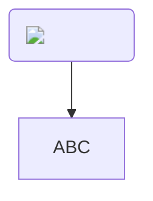

[How to insert an image in flowchart? · Issue #1133 · mermaid-js/mermaid · GitHub](https://github.com/mermaid-js/mermaid/issues/1133)


```
graph TD
  DIR("")
  DIR --> ABC
```



[](https://mermaid-js.github.io/mermaid-live-editor/edit#pako:eNo9j0-LwjAQxb9KmEtdaK2Lt_gH1O5hwZO7x1xCMm0DTVKSya4ifndTKh4GZt778R5zB-U1AocuyLFnv41wjDXfl4WArbEdi0Htip5ojLyujfIuKp9oqbytbawmoVp_rq55lqPrig37N5r6XbFeFazeC_iY8g7H0yuWVdV-OqEEi8FKo3P1fTIFUI8WBfC8amxlGkhAOVsRVQqGbmf8w2FGBu9jpoV75CyZyP_cnAJOIWEJadSSsDEyf2WBt3KIb_VLG_JhJh9PxOhSQQ)
