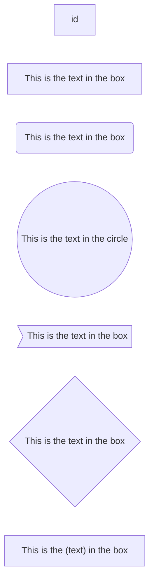
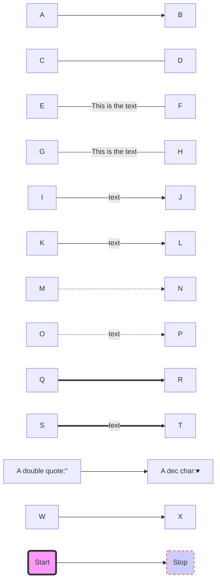
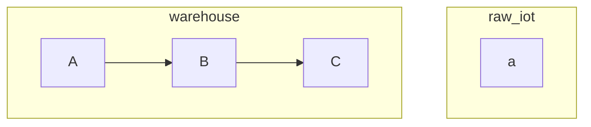
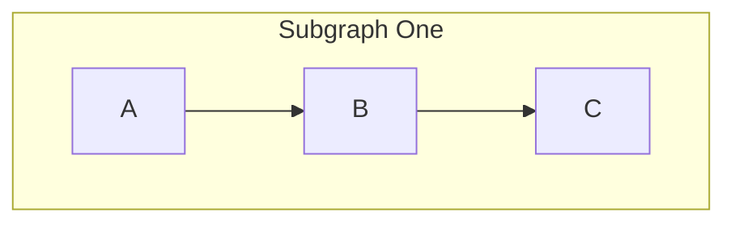

# Flowchart examples

[mermaid-gitbook/content/flowchart.md at master · mermaidjs/mermaid-gitbook · GitHub](https://github.com/mermaidjs/mermaid-gitbook/blob/master/content/flowchart.md)

# Nodes in Subgraphs

[Grouping Mermaid nodes in Subgraphs](https://waylonwalker.com/mermaid-subgraphs/)

# Direction in subgraphs

[Flowcharts Syntax | Mermaid](https://mermaid.js.org/syntax/flowchart.html#direction-in-subgraphs)

[javascript - Mermaid Subgraphs Laid Out Inconsistently - Stack Overflow](https://stackoverflow.com/questions/71803509/mermaid-subgraphs-laid-out-inconsistently)

